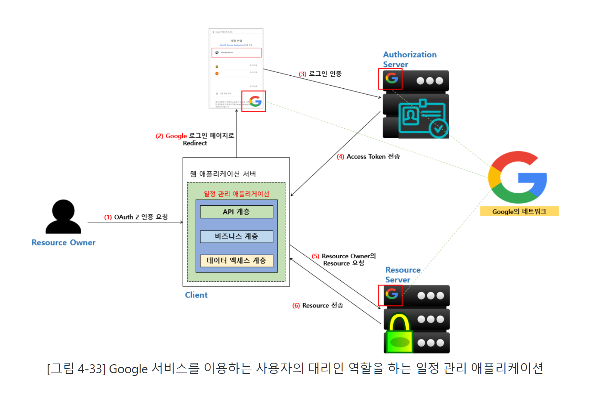
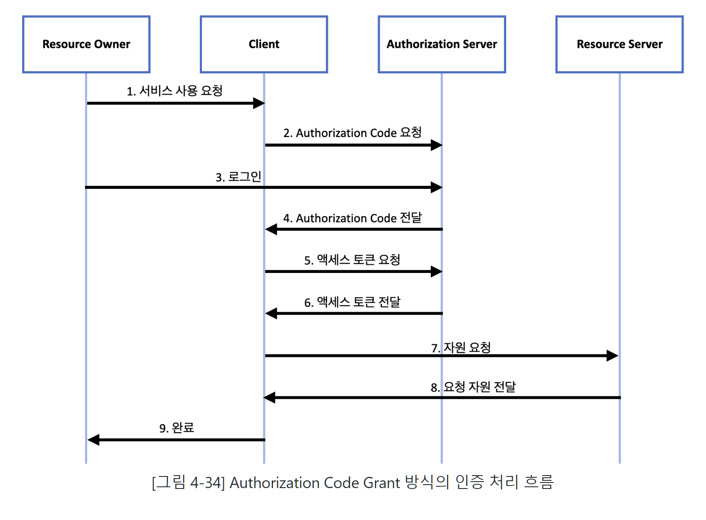
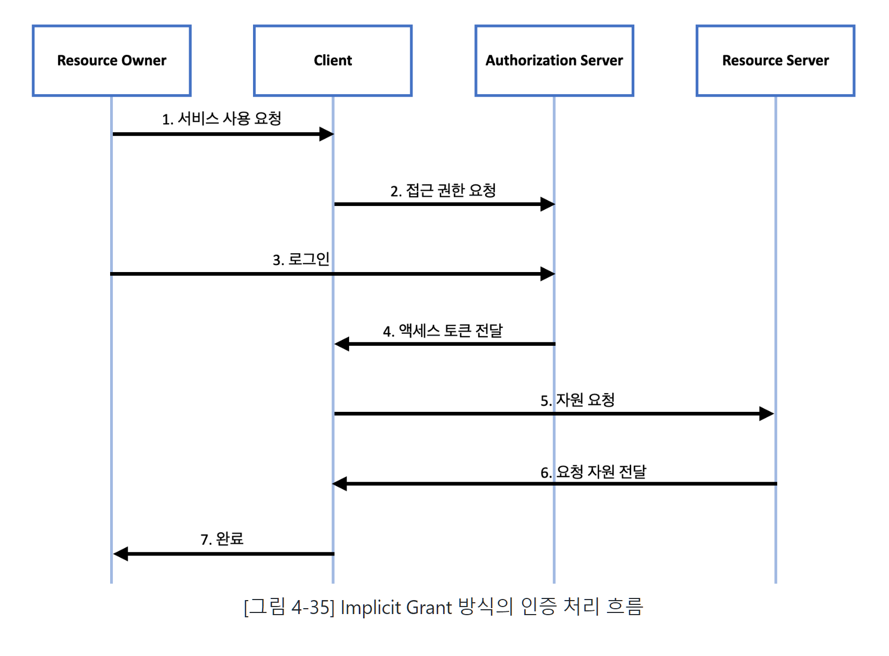
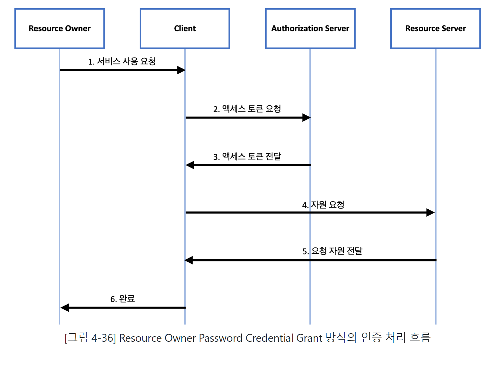
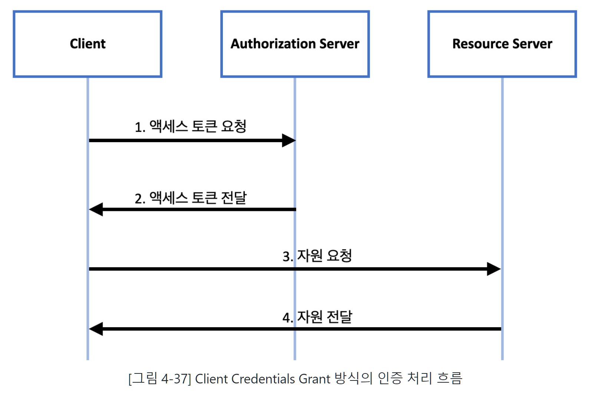
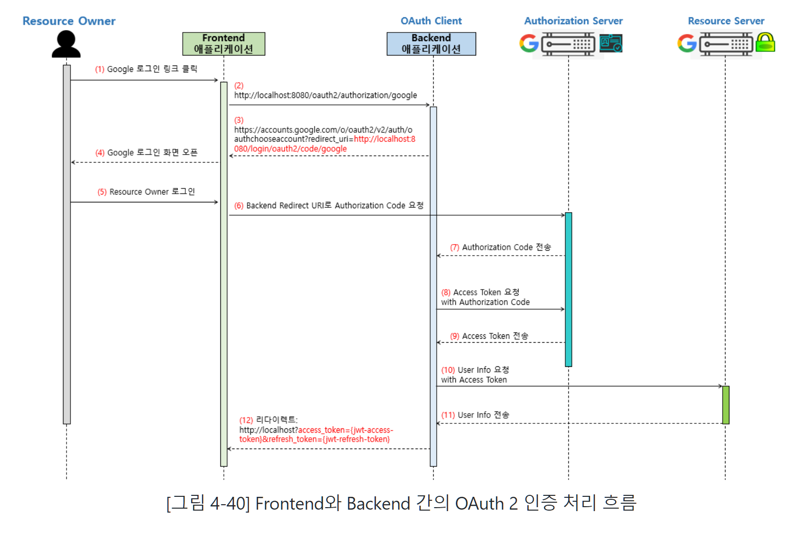

# OAuth2란 무엇일까요?!
OAuth 2는 특정 애플리케이션(Client)에서 사용자의 인증을 직접 처리하는 것이 아니라 
사용자 정보를 보유하고 있는 신뢰할 만한 써드 파티 애플리케이션(GitHub, Google, Facebook 등)에서 
사용자의 인증을 대신 처리해 주고 Resource에 대한 자격 증명용 토큰을 발급한 후, 
Client가 해당 토큰을 이용해 써드 파티 애플리케이션의 서비스를 사용하게 해주는 방식입니다.

# OAuth 2 인증 컴포넌트(Component, 구성요소)들의 역할
Resource Owner
- Resource의 소유자를 말한다. / 서비스를 이용하는 user를 뜻한다.

Client
-  Resource에 액세스하는 애플리케이션이다.

Resource Server
-  Client의 요청을 수락하고 Resource Owner에게 해당하는 Resource를 제공하는 서버

Authorization Server
- Client가 Resource Server에 접근할 수 있는 권한을 부여하는 서버이다.
-  Client에게 Access Token 형태로 Resource Owner의 Resource에 접근할 수 있는 권한을 부여한다.

# OAuth 2 인증 프로토콜에서 사용되는 용어
Authorization Grant
- Client 애플리케이션이 Access Token을 얻기 위한 Resource Owner의 권한을 표현하는 크리덴셜(Credential)을 의미
- Client가 Access Token을 얻기 위한 수단.
- Authorization Code, Implicit Grant Type, Client Credentials, Resource Owner Password Credentials

Access Token
- Client가 Resource Server에 있는 보호된 Resource에 액세스하기 위해 사용하는 자격 증명용 토큰
- Authorization Code와 Client Secret을 이용해 Authorization Server로 부터 전달 받은 Access Token으로 자격을 증명하면 Resource Server에 접근할 수 있다.

Scope
- Scope는 주어진 액세스 토큰을 사용하여 액세스할 수 있는 Resource의 범위이다.
- 예를 들어 Scope 설정을 통해 해당 Resource Owner의 사진첩에는 접근할 수 있지만, 연락처 등 다른 Resource에는 접근할 수 없도록 접근 권한을 지정할 수도 있다.

# Authorization Grant 유형
Authorization Code Grant
- 권한 부여 승인을 위해 자체 생성한 Authorization Code를 전달하는 방식으로, 가장 많이 쓰이고 기본이 되는 방식으로
- Refresh Token을 사용할 수 있다.
- 권한 부여 승인 요청시 응답 타입(response_type)을 code로 지정하여 요청한다.

Implicit Grant
- 별도의 Authorization Code 없이 바로 Access Token을 발급하는 방식
- 자격증명을 안전하게 저장하기 힘든 Client(자바스크립트 등 스크립트 언어를 사용하는 브라우저)에게 최적화된 방식이다.
- Refresh Token 사용이 불가능하며, Authorization Server는 Client Secret을 통해 클라이언트 인증 과정을 생략한다.
- 권한 부여 승인 요청시 응답 타입(response_type)을 token으로 지정하여 요청한다.

Resource Owner Password Credential Grant
- 간단하게 로그인 시 필요한 정보(username, password)로 Access Token을 발급받는 방식
- 자신의 서비스에서 제공하는 애플리케이션의 경우에만 사용되는 인증 방식으로, Refresh Token의 사용도 가능
- ex) 네이버 계정으로 네이버 웹툰 애플리케이션에 로그인, 카카오 계정으로 카카오 지도 애플리케이션에 로그인
- Authorization Server, Resource Server, Client가 모두 같은 시스템에 속해 있을 때만 사용이 가능

Client Credentials Grant
- Client 자신이 관리하는 Resource 혹은 Authorization Server에 해당 Client를 위한 제한된 Resource 접근 권한이 설정되어 있는 경우
- 자격 증명을 안전하게 보관할 수 있는 Client에서만 사용되어야 하며, Refresh Token의 사용은 불가능

# 새로운 용어
크리덴셜(Credential)
- 크리덴셜(Credential)의 사전적 의미는 ‘자격증명’이다.
- 특정인이 해당 자격을 가지고 있는지를 증명하는 수단을 의미

# Frontend와 Backend 간의 OAuth 2 인증 처리 흐름

