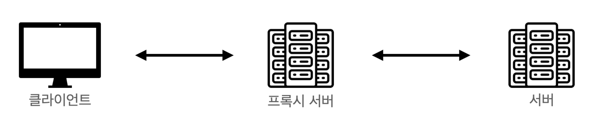
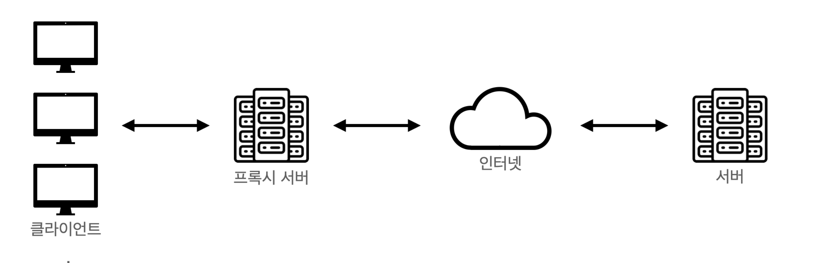
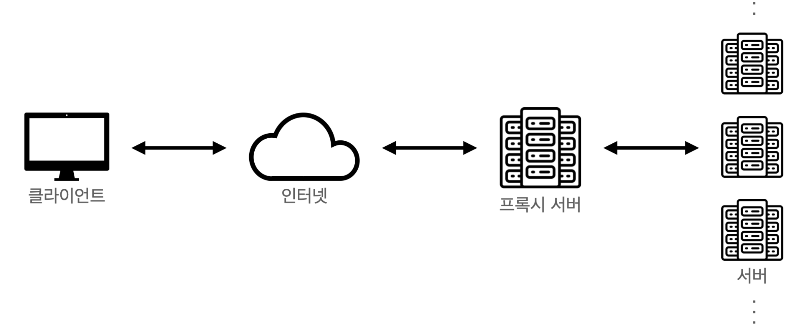

# 프록시 서버란 무엇일까?

proxy 
- 대리

proxy server 
- 서버에 바로 접근하지 않고 자신을 통해 서버에 접근할 수 있도록 해주는 역할
- 보통 일반 사용자는 지역이 제한되어있는 서비스를 이용하기 위해 우회하거나, 캐시를 통해 더 빠른 이용을 하기 위해 프록시 서버를 사용

# 프록시 서버의 종류
프록시 서버가 클라이언트에 가까이 있는지, 서버에 가까이 있는지로 구분할 수 있다.

1. Forward Proxy

클라이언트 가까이에 위치한 프록시 서버로 클라이언트를 대신해 서버에 요청을 전달
- 주로 캐싱을 제공하는 경우가 많아 사용자가 빠른 서비스 이용을 할 수 있도록 도와준다.
- 클라이언트는 서비스의 서버가 아닌 프록시 서버와 소통하게 되며, 그러한 과정에서 여러 클라이언트가 동일한 요청을 보내는 경우 첫 응답을 하며 결과 데이터를 캐시에 저장해놓고, 
- 이후 서버에 재 요청을 보내지 않아도 다른 클라이언트에게 빠르게 전달할 수 있다.
- 클라이언트에서 프록시 서버를 거친 후 서버에 요청이 도착하기 때문에, 서버에서 클라이언트의 IP 추적이 필요한 경우 클라이언트의 IP가 아닌 프록시 서버의 IP가 전달된다. 
- 서버가 응답받은 IP는 프록시 서버의 IP이기 때문에 서버에게 클라이언트를 숨길 수 있다.

2. Reverse Proxy 

서버 가까이에 위치한 프록시 서버로 서버를 대신해서 클라이언트에 응답을 제공
- 클라이언트 - 서버 구조에서 사용자가 많아져 서버에 과부하가 올 경우를 위해 부하를 분산할 수 있다. 
- Reverse Proxy 구조에서 프록시 서버로 요청이 들어오면 여러대의 서버로 요청을 나누어 전달 후 처리한다.
- 클라이언트에게 서버를 숨길 수 있다.
클라이언트 입장에서의 요청보내는 서버가 프록시 서버가 되므로 실제 서버의 IP주소가 노출되지 않는다.