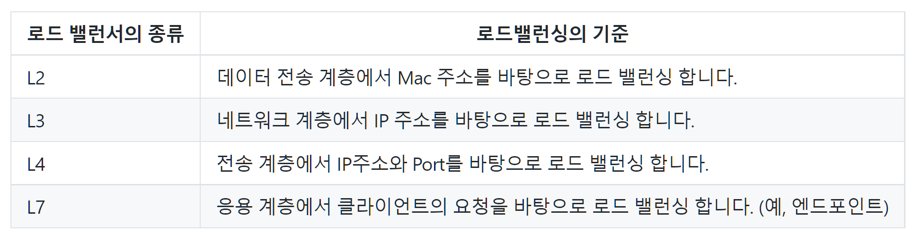

# 로드밸런서

    과부하로 인해 서버가 원활한 서비스를 제공하지 못하는 경우를 해결하기 위해 크게 
    서버의 하드웨어를 업그레이드하는 방법과 서버의 갯수를 늘리는 방법, 두가지 선택을 할 수 있다.

    1. Scale-Up
    - 물리적으로 서버의 사양을 높이는 하드웨어적인 방법
    - 서버의 수를 늘리지 않고 프로그램 구현에 있어 변화가 필요없다는 장점이 있다.
    - 하지만 서버의 사양을 높이는데엔 굉장히 높은 비용이 들고, 하드웨어의 업그레이드엔 한계있다는 큰 단점이 있다.
    - 사양을 늘린만큼 클라이언트의 요청이 더욱 많아진다면, 서버에 발생하는 부하는 여전히 해결하지 못한 상황이 된다.

    2. Scale-Out
    - 서버의 갯수를 늘려 하나의 서버에 줄 부하를 분산시키는 방법
    - 많은 요청이 오더라도 여러대의 서버가 나눠서 처리를 하기 때문에 서버의 사양을 높이지 않고도 비교적 저렴한 방법으로 부하를 처리할 수 있다.

Scale-Out방법으로 여러대의 서버로 부하를 처리하는 경우, 클라이언트로부터 온 요청을 여러 서버 중 어느 서버에 보내서 처리해야할까?
요청을 여러 서버에 나눠 처리할 수 있도록 교통정리를 해줄 역할이 필요하다.
이 역할을 하는게 바로 로드 밸런서이고, 여러 서버에 교통정리를 해주는 기술 혹은 프로그램을 로드 밸런싱이라고 부른다.

# 로드 밸런서의 종류

로드 밸런서는 클라이언트의 요청을 어떤 것을 기준으로 분산시키냐에 따라 네 가지의 종류로 나뉜다.

