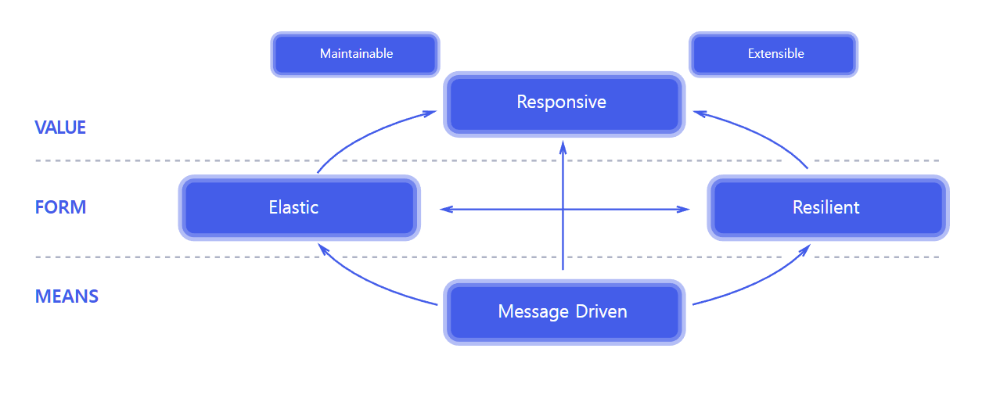

# 리액티브 프로그래밍이(Reactive Programing)란 무엇일까?
리액티브 프로그래밍은 선언형 프로그래밍 방식을 사용한다.
리액티브 시스템은 한마디로 반응을 잘하는 시스템을 의미한다.
즉, 클라이언트의 요청에 반응하는 시스템을 의미한다.

리액티브 시스템은 클라이언트의 요청에 응답 대기 시간을 최소화할 수 있도록 요청 쓰레드가 차단되지 않게 Non-Blocking 함으로써
클라이언트에게 즉각적으로 반응할 수 있도록 구성된 시스템이다.

# 리액티브 시스템의 특징 

1. MEANS
리액티브 시스템에서 사용하는 커뮤니케이션 수단을 의미한다.
- Message Driven : 리액티브 시스템에서는 메시지 기반 통신을 통해 여러 시스템 간에 느슨한 결합을 유지한다.

2. FORM 
메시지 기반 통신을 통해 리액티브 시스템이 어떤 특성을 가지는 구조로 형성되는지를 의미한다.
- Elastic : 시스템으로 들어오는 요청량이 적거나 많거나에 상관없이 일정한 응답성을 유지하는 것을 의미한다.
- Resillient : 시스템의 일부분에 장애가 발생하더라도 응답성을 유지하는 것을 의미한다.

3. VALUE 
리액티브 시스템의 핵심 가치가 무엇인지를 표현하는 영역
- Responsive : 액티브 시스템은 클라이언트의 요청에 즉각적으로 응답할 수 있어야 함을 의미합니다
- Maintainable : 클라이언트의 요청에 대한 즉각적인 응답이 지속가능해야 함을 의미
- Extensible : 클라이언트의 요청에 대한 처리량을 자동으로 확장하고 축소할 수 있어야 함을 의미

# 리액티브 프로그래밍의 특징

declarative programming paradigm
- 리액티브 프로그래밍은 선언형 프로그래밍 방식을 사용한다.

data streams and the propagation of change
- data streams는 지속적으로 데이터가 입력으로 들어오고 그 과정에서 데이터의 변경이 발생하며 이 변경 자체를 이벤트로 간주하고 이벤트가 발생할 때마다 데이터를 전달한다.

automatic propagation of the changed data flow
- 지속적으로 발생하는 데이터를 하나의 데이터 플로우로 보고 데이터를 자동으로 전달한다.

# 리액티브 스트림즈(Reactive Streams)란?
리액티브 스트림즈(Reactive Streams)는 리액티브 프로그래밍을 위한 표준 사양(또는 명세, Specification)이다.

# 리액티브 스트림즈 컴포넌트(구성요소)
Publisher
- Publisher 인터페이스는 데이터 소스로 부터 데이터를 내보내는(emit) 역할을 한다.
- subscribe() 는 Publisher가 내보내는 데이터를 수신할 지 여부를 결정하며 반적으로 subscribe()가 호출되지 않으면 Publisher가 데이터를 내보내지 않는다.

Subscriber
- Subscriber 인터페이스는 Publisher로부터 내보내진 데이터를 소비하는 역할을 한다.
- onSubscribe(Subscription s) : 구독이 시작되는 시점에 호출되며, onSubscribe() 내에서 Publisher에게 요청할 데이터의 개수를 지정하거나 구독 해지 처리를 할 수 있다.
- onNext(T t) : Publisher가 데이터를 emit할 때 호출되며, emit된 데이터를 전달 받아서 소비할 수 있다.
- onError(Throwable t) : Publisher로부터 emit된 데이터가 Subscriber에게 전달되는 과정에서 에러가 발생할 경우에 호출된다.
- onComplete() : Publisher가 데이터를 emit하는 과정이 종료될 경우 호출되며, 데이터의 emit이 정상적으로 완료 된 후, 처리해야 될 작업이 있다면 onComplete() 내에서 수행할 수 있다.

Subscription
- Subscriber의 구독 자체를 표현한 인터페이스이다.
- request(long n) : Publihser가 emit하는 데이터의 개수를 요청한다.
- cancel() : 구독을 해지하는 역할을 한다. 즉, 구독 해지가 발생하면 Publisher는 더이상 데이터를 emit하지 않는다.

Processor
Processor 인터페이스는 Subscriber 인터페이스와 Publisher 인터페이스를 상속하고 있기 때문에 Publisher와 Subscriber의 역할을 동시에 할 수 있는 특징을 가지고 있으며, 별도로 구현해야 되는 추상 메서드는 없다.

# 리액티브 스트림즈의 구현체 종류
Project Reactor
- Project Reactor(줄여서 Reactor)는 리액티브 스트림즈를 구현한 대표적인 구현체로써 Spring과 궁합이 가장 잘 맞는 리액티브 스트림즈 구현체이며, 
- Spring 5의 리액티브 스택에 포함되어 있으며 Sprig Reactive Application 구현에 있어 핵심적인 역할을 담당하고 있다.

RxJava
- RxJava는 .NET 기반의 리액티브 라이브러리를 넷플릭스에서 Java 언어로 포팅한 JVM 기반의 리액티브 확장 라이브러리이다.
- RxJava의 경우 2.0부터 리액티브 스트림즈 표준 사양을 준수하고 있으며, 이 전 버전의 컴포넌트와 함께 혼용되어 사용이 되고 있다.

Java Flow API
- Java 9부터 리액티브 스트림즈를 지원하고 있다.
- Flow API는 리액티브 스트림즈를 구현한 구현체가 아닌 리액티브 스트림즈 표준 사양을 Java 안에 포함을 시킨 구조라고 볼 수 있다.
- 즉, Flow API는 리액티브 스트림즈 사양을 구현한 여러 구현체들에 대한 SPI(Service Provider Interface) 역할을 한다.

대표적인 리액티브 확장(Reactive Extension) 라이브러리로 RxJava가 있으며, 이외에도 RxJS, RxAndroid, RxKotlin, RxPython, RxScala 등이 있다.

*RxJava의 Rx는 Reactive Extension의 줄임말이다.